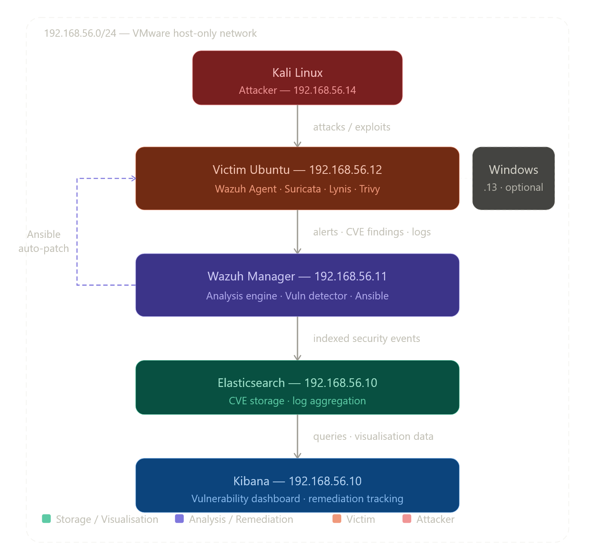
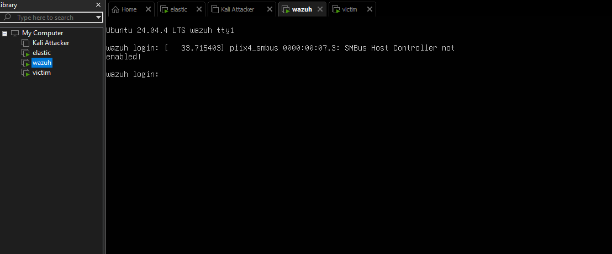
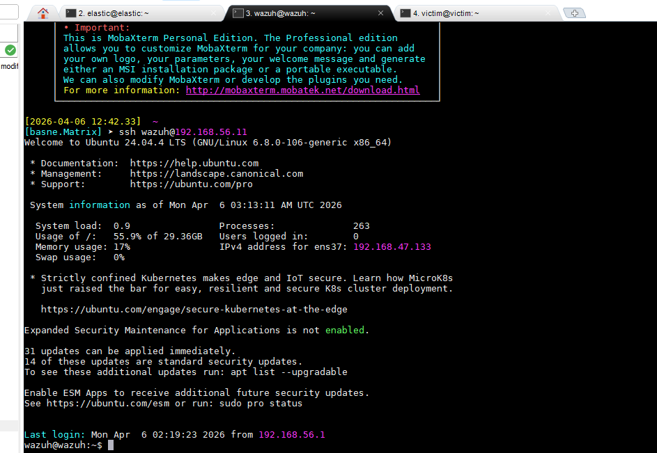
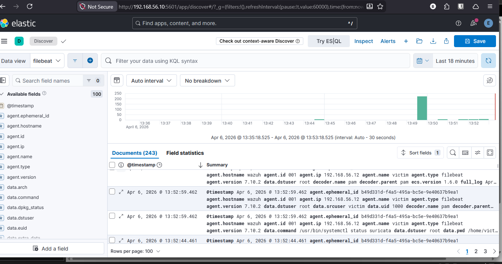
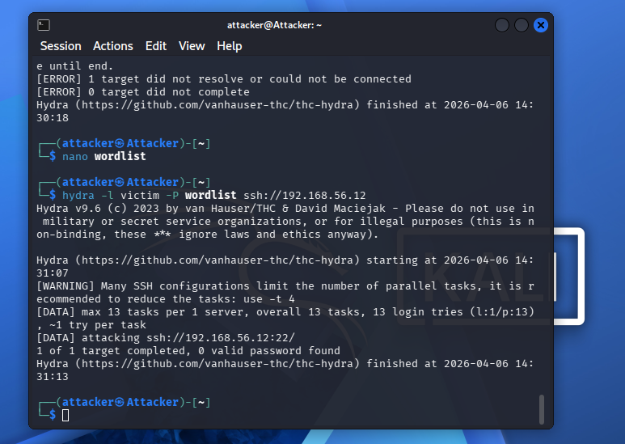
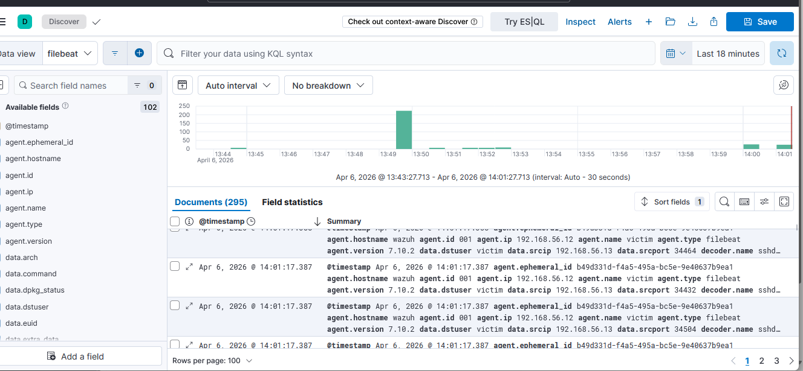

# SOC Home Lab — Wazuh, ELK Stack, Suricata & Kali Linux

> A fully functional Security Operations Centre (SOC) home lab built to simulate real-world cyber attacks and demonstrate end-to-end detection, alerting, log aggregation, and analysis.

---

## Table of Contents

- [Overview](#overview)
- [Architecture](#architecture)
- [Environment Setup](#environment-setup)
- [Implementation Steps](#implementation-steps)
- [Attack Simulations](#attack-simulations)
- [Detection Results](#detection-results)
- [Key Findings](#key-findings)
- [Roadmap](#roadmap)

---

## Overview

This project implements a SOC home lab using the following open-source tools:

| Tool              | Purpose                                                |
| ----------------- | ------------------------------------------------------ |
| **Wazuh**         | Host-based intrusion detection and security monitoring |
| **Elasticsearch** | Centralised log storage and indexing                   |
| **Kibana**        | Log visualisation and security dashboard               |
| **Suricata**      | Network-based intrusion detection (NIDS)               |
| **Kali Linux**    | Attack simulation and penetration testing              |

The lab demonstrates a layered detection approach — combining host-based and network-based monitoring — to capture attacks that neither tool alone can detect.

---

## Architecture

The lab is segmented into an isolated internal network (`192.168.56.0/24`) with NAT for internet access where required. Each service runs on a dedicated VM to reflect an enterprise-grade, separation-of-concerns design.

### Architecture Diagram



### Traffic Flow

```
Kali Linux (Attacker)
        │
        │  attacks / exploits
        ▼
Victim Ubuntu (Wazuh Agent + Suricata)
        │
        │  host alerts + network events
        ▼
Wazuh Manager (Analysis Engine)
        │
        │  indexed security findings
        ▼
Elasticsearch (Log Storage)
        │
        │  queries
        ▼
Kibana (Visualisation & Dashboards)
```

---

## Environment Setup

### Virtual Machines

|Machine|Role|IP Address|
|---|---|---|
|ELK Server|Elasticsearch + Kibana|192.168.56.10|
|Wazuh Server|Wazuh Manager|192.168.56.11|
|Victim Ubuntu|Wazuh Agent + Suricata|192.168.56.12|
|Kali Linux|Attacker|192.168.56.13|



### Networking Design

- **VMnet2** (`192.168.56.x`) — Isolated internal lab network for all VM-to-VM communication
- **NAT** (`192.168.47.x`) — Internet access for package installation and updates

### Remote Access

All VMs are accessed via **MobaXterm**, which provides a unified SSH terminal with a built-in file manager — significantly simplifying multi-VM management.



---

## Implementation Steps

### 1. ELK Stack Setup

Elasticsearch and Kibana were installed on the dedicated ELK server at `192.168.56.10`.

**Configuration files:**

- `/etc/elasticsearch/elasticsearch.yml`
- `/etc/kibana/kibana.yml`

Both were configured to bind to the internal network interface so other VMs can reach them.

**Verification:**

```bash
# Confirm Elasticsearch is running
curl http://localhost:9200
```

**Kibana access:**

```
http://192.168.56.10:5601
```



---

### 2. Wazuh Manager Setup

The Wazuh Manager was installed on a dedicated server at `192.168.56.11`. It acts as the central analysis engine, receiving and processing security events from all registered agents.

**Verify incoming alerts:**

```bash
sudo tail -f /var/ossec/logs/alerts/alerts.json
```

---

### 3. Wazuh Agent Setup (Victim Machine)

The Wazuh Agent was installed on the victim Ubuntu machine and pointed at the Wazuh Manager.

```bash
sudo apt install wazuh-agent -y
sudo nano /var/ossec/etc/ossec.conf
```

Set the manager address in `ossec.conf`:

```xml
<client>
  <server>
    <address>192.168.56.11</address>
  </server>
</client>
```

Enable and start the agent:

```bash
sudo systemctl enable wazuh-agent
sudo systemctl start wazuh-agent
```

---

### 4. Filebeat Integration

Filebeat was configured on the Wazuh Manager to forward processed alerts to Elasticsearch for indexing.

```yaml
output.elasticsearch:
  hosts: ["https://192.168.56.10:9200"]
  username: "elastic"
  password: "PASSWORD"
  ssl.verification_mode: none
```

> **Note:** In a production environment, SSL verification should be enabled with a valid certificate.

---

### 5. Suricata Setup (Network-Based Detection)

Suricata was installed on the victim machine to provide network-level intrusion detection alongside Wazuh's host-based monitoring. This dual-layer approach is critical — Wazuh alone cannot detect network-level attacks such as port scans.

**Installation and rule update:**

```bash
sudo apt install suricata -y
sudo suricata-update
```

**Configure the monitored interface in `/etc/suricata/suricata.yaml`:**

```yaml
af-packet:
  - interface: ens33
```

**Integrate Suricata alerts into Wazuh** by adding the following to `/var/ossec/etc/ossec.conf`:

```xml
<localfile>
  <log_format>json</log_format>
  <location>/var/log/suricata/eve.json</location>
</localfile>
```

This allows Wazuh to ingest Suricata's `eve.json` output and forward network-level alerts through the same pipeline to Elasticsearch and Kibana.

---

## Attack Simulations

All attacks were launched from the Kali Linux machine (`192.168.56.13`) targeting the victim Ubuntu machine (`192.168.56.12`).

### Nmap Port Scan

An aggressive scan was performed to enumerate open ports and services on the victim.

```bash
nmap -sS -A 192.168.56.12
```

- **Without Suricata:** Not detected — Wazuh has no visibility into raw network traffic.
- **With Suricata:** Detected — Suricata's network signatures triggered an alert which was forwarded to Wazuh and surfaced in Kibana.

---

### SSH Brute Force (Hydra)

A dictionary-based brute force attack was performed against the victim's SSH service.

```bash
hydra -l ubuntu -P passwords.txt ssh://192.168.56.12
```



Wazuh detected the repeated authentication failures generated by Hydra and raised alerts in real time.

**Result in Kibana:**



---

## Detection Results

The following table summarises the detection outcomes for each attack simulation:

|Attack|Tool|Detected|
|---|---|---|
|SSH brute force|Wazuh (host-based)|✅ Yes|
|sudo privilege activity|Wazuh (host-based)|✅ Yes|
|Nmap port scan (pre-Suricata)|Wazuh only|❌ No|
|Nmap port scan (post-Suricata)|Wazuh + Suricata|✅ Yes|

### Kibana Search Queries Used

```
event_type : "alert"
sshd
authentication failure
scan
```

---

## Key Findings

**Wazuh alone is insufficient for network-level detection.** Wazuh is a host-based IDS — it relies on system logs, file integrity monitoring, and agent-reported events. It has no visibility into raw network traffic. An Nmap scan, for example, produces no log entries on the target host by default, so Wazuh cannot detect it.

**Suricata fills the network detection gap.** Once Suricata was deployed and integrated with Wazuh, network-level attacks — including port scans — were captured via Suricata's rule engine and surfaced through the same Kibana dashboard. This demonstrates the value of layering host-based and network-based detection.

**A unified pipeline simplifies analysis.** By routing all alerts (Wazuh + Suricata) through a single Elasticsearch + Kibana stack, analysts have a single pane of glass for triage. This mirrors the architecture used in enterprise SOC environments.

---

## Roadmap

The following components are planned for future implementation:

- [ ] **Ansible** — Automated remediation playbooks triggered by Wazuh alerts
- [ ] **Vulnerability detection** — Enable Wazuh's built-in vulnerability detector to cross-reference installed packages against CVE databases
- [ ] **Patch management pipeline** — Python-based triage script to prioritise CVEs by CVSS score and trigger Ansible remediation automatically
- [ ] **Windows victim VM** — Add a Windows agent to demonstrate cross-platform detection coverage

> Hardware constraints (16 GB RAM) currently limit simultaneous VM count. The Windows victim VM has been deprioritised in favour of stability.

---

## Tools & Technologies

- [Wazuh](https://wazuh.com/) — Open-source SIEM and XDR
- [Elasticsearch](https://www.elastic.co/elasticsearch/) — Distributed search and analytics engine
- [Kibana](https://www.elastic.co/kibana/) — Data visualisation for Elasticsearch
- [Suricata](https://suricata.io/) — High-performance network IDS/IPS
- [Kali Linux](https://www.kali.org/) — Penetration testing distribution
- [MobaXterm](https://mobaxterm.mobatek.net/) — SSH client with multi-session management
- [VMware Workstation](https://www.vmware.com/) — Desktop virtualisation

---

_Architecture diagram generated with Claude AI._
_Architecture diagram and document refined with Claude AI._
